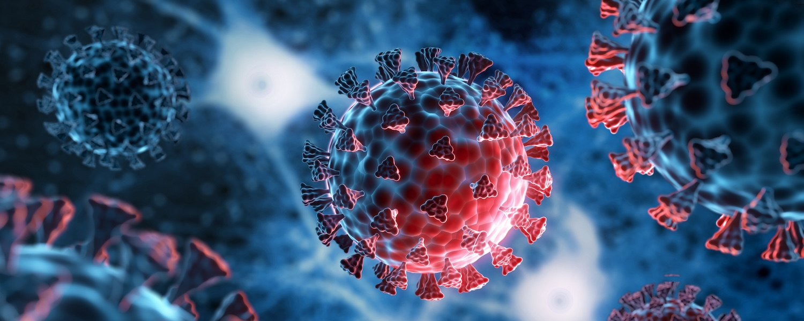

# Final Project for GPH-GU 2182 Statistical Programming in R Course

## Overview

The COVID-19 pandemic exacerbated existing health disparities in the United States, disproportionately impacting racial and ethnic minority groups. This project aimed to investigate the differential burden of COVID-19 outcomes, including cases, deaths, hospitalizations, and testing rates, across racial and ethnic communities.

## Dataset

The project uses national-level and state-level COVID-19 data obtained from [**The New York Times COVID-19 dataset**](https://github.com/nytimes/covid-19-data), combined with the [**COVID Racial Data Tracker**](https://covidtracking.com/race) and population estimates from the [**American Community Survey (ACS) Demographic and Housing 5-Year Estimates (2019)**](https://data.census.gov/table/ACSDP5Y2019.DP05).

## Methods

The analysis involved the following steps: 

1. **Data Preparation**: Cleaning, merging, and aggregating the datasets at state and racial group levels to calculate cumulative monthly rates (per 100,000 population) for cases, deaths, hospitalizations, and tests.  
2. **Exploratory Data Analysis**: Visualizing and summarizing trends to identify disparities across racial groups.  
3. **Regression Analysis**: A multiple linear regression model examined relationships between case rates and key predictors—testing rates, hospitalization rates, and death rates—while accounting for racial group differences.  

## Key Insights

The analysis revealed significant racial disparities in COVID-19 outcomes: 

- **Cases**: The White population had the highest cumulative case counts, but Native Hawaiian/Pacific Islander (NHPI) and Black groups exhibited the highest case rates per 100,000.  
- **Deaths**: The Black population experienced the highest death rates, followed by NHPI and AIAN groups, highlighting a greater burden of severe outcomes in these communities.  
- **Hospitalizations**: Hospitalization rates were highest among Black, NHPI, and AIAN populations, reflecting unequal access to early interventions and preventive care.  
- **Testing**: While NHPI and Black groups had the highest cumulative testing rates, Multiracial populations consistently showed lower testing rates, raising concerns about access to testing resources.  
- **Regression Analysis**: Testing rates, hospitalization rates, and death rates significantly predicted case rates. Disparities were also observed across racial groups, with the AIAN group serving as the reference category.
